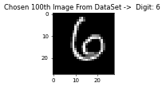
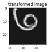
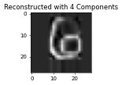

### Objective:

    Project to Study Change of Basis and Linear Transformations

### About the Student

    Name: Swara Valsangikar
    Date: 04/20/2026
    University: University of North Carolina at Charlotte
    Department: Mathematics

#### Languages and Libraries

    Python
    numpy
    matplotlib
    pandas
    shutil
    pathlib
    time

#### Dataset Used

    kaggle MNIST

#### How to Run the Project

    1. Navigate to the project directory:
    2. Create a virtual environment: `python -m venv venv`
    3. Activate the virtual environment: `source venv/bin/activate` (Linux/Mac) or `venv\Scripts\activate` (Windows)
    4. Install dependencies: `pip install -r requirements.txt`
    5. Run the project: `python main.py`

#### Project Description

    DataSet
        handwritten digits (grayscale images):
        https://www.kaggle.com/datasets/oddrationale/mnist-in-csv

#### Step 1: Data Preparation

    1.Load one image (or a small matrix dataset) into your program as a 2D array 𝐴∈ℝ𝑚×𝑛.
    2.Flatten or reshape the image into a vector 𝑣∈ℝ𝑚𝑛.
    3.Visualize the original data (image or plot).

#### Step 2: Construct and Analyze Bases

    1.Define two sets of basis vectors in ℝ2or ℝ3:
        The standard basis {𝑒1,𝑒2,𝑒3}.
        Several new basis 𝐵={𝑏1,𝑏2,𝑏3} of your choice (must be linearly independent).
    2.Compute the change-of-basis matrix 𝑃from the standard basis to 𝐵.
    3.Verify that 𝑃−1converts coordinates back to the standard basis.

#### Step 3: Linear Transformation in Different Bases

    1.Define a linear transformation 𝑇such as:
        Rotation: 𝑇=[cos𝜃−sin⁡𝜃sin𝜃cos𝜃]
        Scaling or shearing matrix.
    2.Compute the matrix of 𝑇in both bases:
        [𝑇]𝐵=𝑃−1𝑇𝑃
    3.Apply both 𝑇and [𝑇]𝐵to your vectorized image and visualize the results.
    4.Discuss how the change of basis affects the representation and transformation, as well as the different visualization of output images.

#### Step 4: PCA-Inspired Basis

    Use Principal Component Analysis (PCA) to derive an orthogonal basis from your dataset.
        • Compute eigenvalues and eigenvectors of the covariance matrix of the image data.
        • Compare this data-driven basis with the manually chosen basis.
        • Visualize reconstruction using a reduced number of principal components.

### Execution

    1.After running the project using python main.py; following menu will appear.
        0: All - default
        1: Draw the image
        2: Example-Change the basis  
        3: Linear Transform by rotation and shearing application on the image
        4: PCA-Application of the image
        5: clean all images and associated folders created    
        Enter your choice; any other key to quit -> (0-5):
    2.Use will enter the step number to be executed.
    3.To execute all steps, enter 0
    4.To execute a particular step, enter the step number

#### option 1: Draw the image

    1. Download mnist_test.csv from the link:https://www.kaggle.com/datasets/oddrationale/mnist-in-csv
    2. Copy the "mnist_test.csv" file to the project directory
    3. get_data_from_dataframe() function will read the csv file and return the image data.
    4. Remove Label column from the dataframe.
    6. Select the 100th row from dataframe of 784 features of digit 6.
    5. Create numpy array of 28x28 shape from the dataframe.
    6. visualize_image() function will visualize the image.
    7. Function will save the image in the directory called original_image.

#### option 2: Example-Change the basis

    1. As per the requirement define the standard basis and new basis. Standard basis is the identity matrix
    where all digonal values are 1 and other values are 0.
    2. Define the new basis of same shape as of the standard basis.
    3. Check the linerity independnce of the basis.
    4. Calculate the change of basis matrix using numpy.linalg.inv() and @ operator.
    5. Revert Back the new basis to the standard basis using numpy.linalg.inv() and @ operator.
    6. check the resultant matrix it should be same as the new basis.

#### option 3: Linear Transform by rotation and shearing application on the image

    1. Leaner transform python library used for linear transformation is numpy.linalg.
    2. In this we define the rotation and shearing matrix.
    3. create_rotation_matrix(angle) will create the rotation matrix based on redian of angle.
    4. shearing() will create the shearing matrix with deafult x=0.2 and y=0 shearing value.
    5. linear_transform_example() function transforms the data using numpy.dot() and .inv().
    6. linear_transformation_image() function transforms the image using numpy.dot() and .inv() 
        uses scipy.ndimage.affine_transform() to apply the transformation using offset and shear.
    7. Original and transformed images saved in the directory called transformed.

#### option 4: PCA-Application of the image

    1. pca_numpy.py file calculates the PCA of the image using numpy.
    2. pca_numpy() function achieves pca  of image in follwoing steps
        a. Get the selected image - Digit '6'
        b. Reshape the image to 28x28
        c. Calculate the covariance matrix of the image data
        d. Calculate the eigenvalues and eigenvectors of the covariance matrix
        e. Sort the eigenvalues and eigenvectors in descending order
        f. Select the top k (default= 4) eigenvectors
        g. Project the image data onto the selected eigenvectors
        h. Reconstruct the image from the projected data
    3. store the original and reconstructed images in the directory called pca.   

#### option 5: clean all images and associated folders created

    This option will delete all the images and folders created during the execution of the program.

#### source code:

    1. main.py 
        - main file,displays the menu and executes the steps
    2. load_and_plot_image.py 
        - loads the image in pandas dataframe reshapes it to 28x28 and plots the image
        - it also saves the image in the directory called original_image
    3. change_basis.py 
        - change of basis matrix calculation and visualization
    4. linear_transform.py 
        - linear transformation calculation and visualization
    5. pca_numpy.py 
        - pca calculation and visualization

#### DataSet Name

    mnist_test.csv

#### Other Installation Methods:

    for installtion of the required libraries.
    1. Navigate to root directory of the project.
    2. can be installed using uv and pip, use uv sync pyproject.toml
        a. install using pip
            pip install -r requirements.txt
        b. install using uv and pip
            uv pip install -r requirements.txt
    